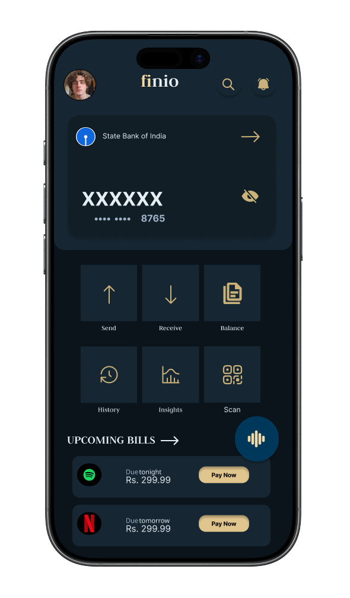
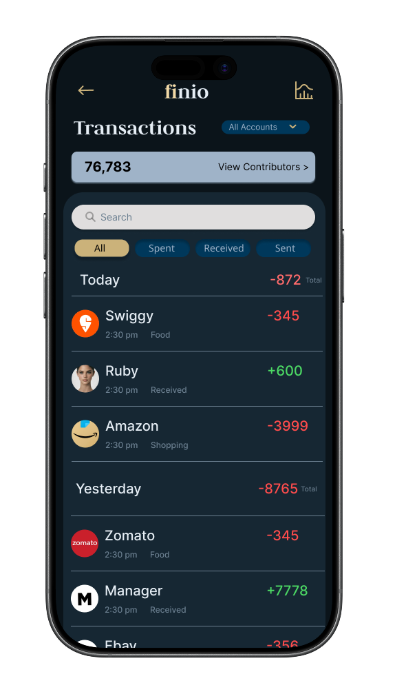
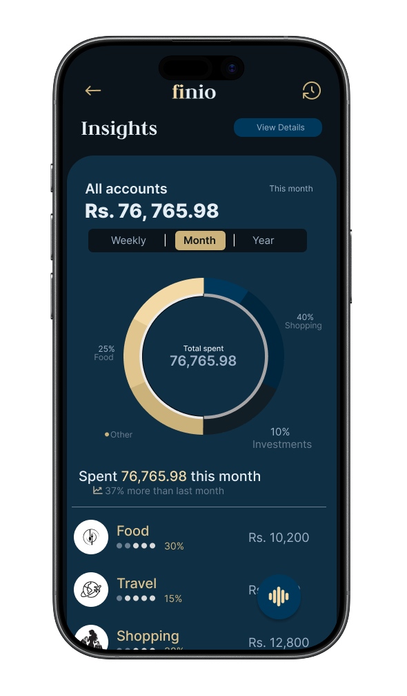
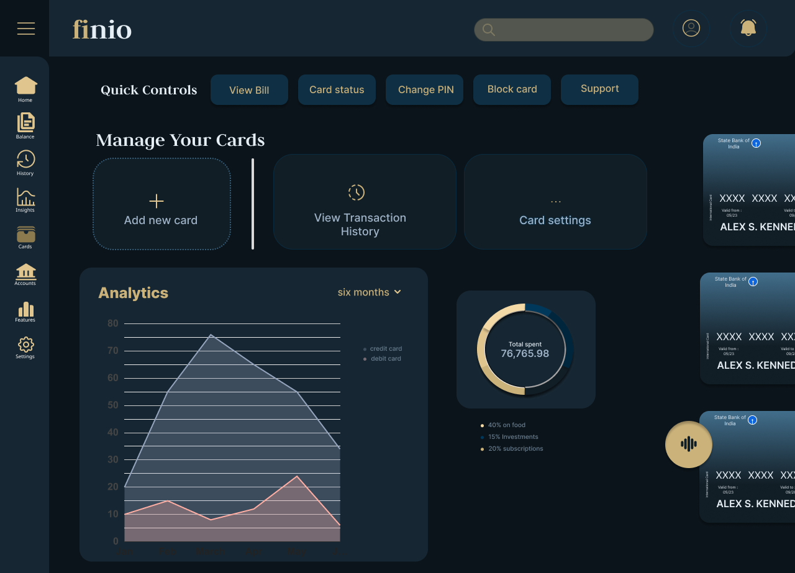

# finio-case-study-uiux
A fintech UI/UX case study focused on clarity, control, and simplicity in managing personal finances, featuring a dark-themed design system and intuitive user experience.

# 💳 Finio – UI/UX Case Study

Finio is a finance management app designed to make handling money a little less confusing and a lot more manageable.

---

## 🧠 Problem

Managing finances often involves:
- juggling multiple apps  
- unclear transaction tracking  
- lack of meaningful insights  

---

## 💡 Solution

Finio provides:
- a clean and structured interface  
- centralized financial features (cards, transactions, insights)  
- intuitive navigation for quick actions  

---

## 🎨 Design Highlights

- Dark theme for reduced visual strain  
- Teal base for trust and stability  
- Gold accents to highlight key actions  
- Clear visual hierarchy and spacing  

---

## 📱 Mobile Screens

  
  
  

---

## 🖥 Desktop Screens

  
  

---

## 🧩 Features

- Card management  
- Transaction tracking  
- Financial insights and analytics  
- Quick actions (send, receive, block, etc.)  

---

## 🔗 Prototype

👉 [View Interactive Prototype](PASTE-YOUR-FIGMA-LINK-HERE)

---

## 🏆 Outcome

- Scored **88/100**  
- Awarded **Certificate of Excellence**  

---

## 🛠 Tools Used

- Figma  
- Canva  

---

## 💬 Note

This project was designed as part of a UI/UX case study to explore clean, user-friendly financial interfaces.
